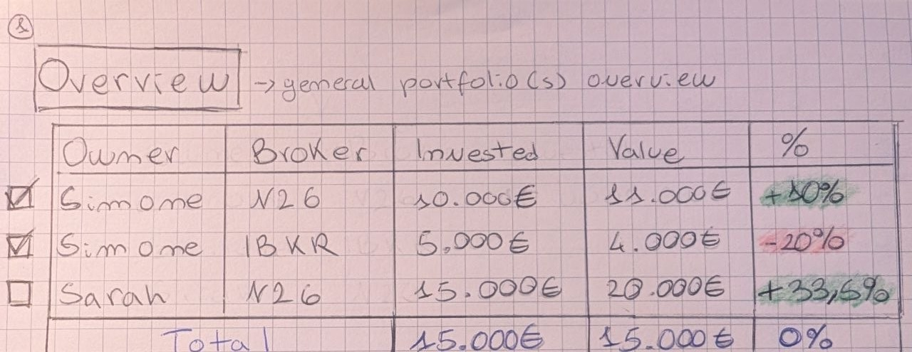

# Initiative

**What:** Implement an interactive **Portfolio Macro-Overview Table** as the foundational view of the Tabularium dashboard (`/tabularium/portfolio`). This component will aggregate raw transaction data to show performance broken down by **Owner** and **Broker Platform**, serving as the gateway to the Milestone 1 "Holding Aggregation Engine."

**Why:** To unlock the currently empty portfolio view and provide multi-portfolio investors with an immediate, high-level snapshot of their net worth distribution. This dynamic breakdown allows users to isolate or combine entities (e.g., separating personal accounts from a partner's or child's account) before diving into deep-dive asset characteristics or X-Ray metrics

**Successful Criteria:**

- **Interactive Row Selection:** A checkbox is available on the far-left of each row, as sketched in **image_436ce7.jpg**, allowing the user to explicitly choose which portfolios to isolate or combine.
- **Master Toggle:** A master checkbox in the table header allows the user to select or deselect all portfolio rows simultaneously with a single click.
- **Instant Dynamic Summarization:** Toggling any checkbox instantly updates all metrics in the "Total" row footer. Unchecked rows are completely omitted from the summary calculation.
- **Rich Performance Metrics:** The performance column displays both the absolute fiat return and the relative percentage return side-by-side (e.g., `+1.000,00 € (+10,00%)`) so the user sees both scale and rate of return.
- **Accurate Weighted Performance:** The "Total %" metric displays a mathematically precise weighted return based on the actual total sums of the selected portfolios, ensuring the user sees the true performance instead of a misleading simple average.
- **Dynamic Weight Allocation:** A "Share" column calculates and displays what percentage of the *currently selected* total value that specific row represents, adjusting dynamically as checkboxes are toggled.
- **Visual Broker Branding:** Each broker row displays a small, high-resolution brand logo immediately preceding the broker's textual name. If a specific logo is unavailable, a clean, generic financial institution icon is displayed as a fallback.
- **Visual Performance Indicators:** Positive financial returns are highlighted with clear green styling (text or subtle pill background), negative returns are highlighted in red, and flat ($0\%$) returns remain visually neutral to give the user immediate visual feedback.
- **Bidirectional Table Sorting:** Clicking any column header (Owner, Broker, Invested, Value, Share, or Performance) immediately sorts the rows in either ascending or descending order (alphabetically for text, numerically for financial figures).
- **Consistent Fallback Displays:** If a portfolio row contains empty or missing data fields, the interface displays a standardized dash (`—`) to maintain a clean, unfragmented table structure, matching the platform's transaction ledger style.
- **Clean Financial Formatting:** All monetary values are presented with clear decimal precision and localized currency symbols (e.g., `10.000,00 €`), preventing raw, unformatted numbers from cluttering the dashboard.
